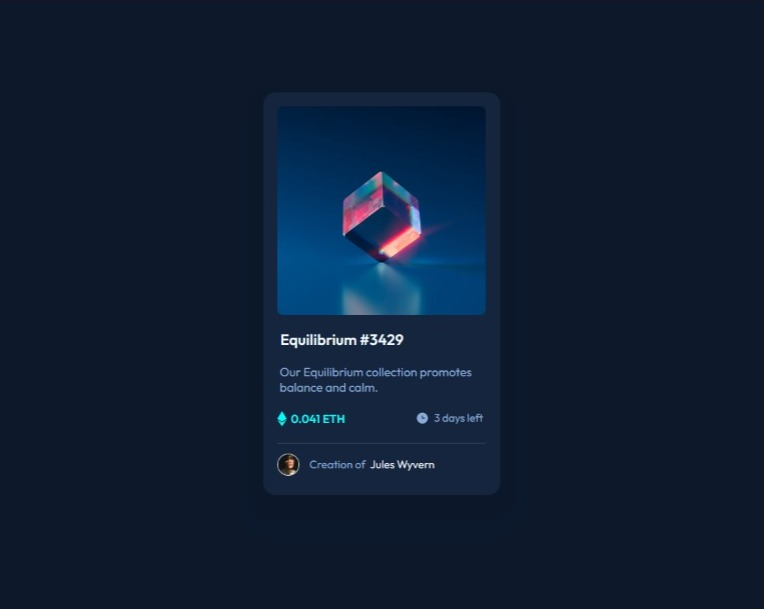
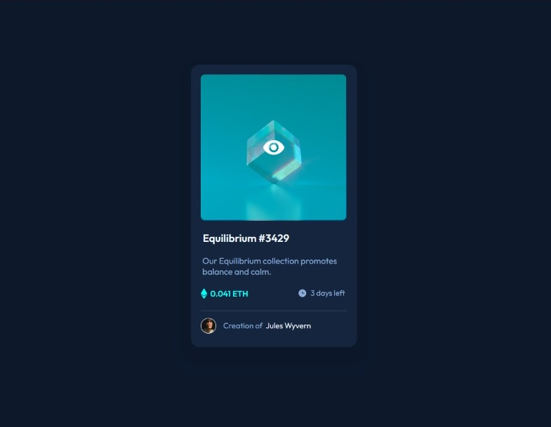

# Frontend Mentor - NFT preview card component solution

This is a solution to the [NFT preview card component challenge on Frontend Mentor](https://www.frontendmentor.io/challenges/nft-preview-card-component-SbdUL_w0U). Frontend Mentor challenges help you improve your coding skills by building realistic projects. 

## Table of contents

- [Overview](#overview)
  - [The challenge](#the-challenge)
  - [Screenshot](#screenshot)
  - [Links](#links)
- [My process](#my-process)
  - [Built with](#built-with)
  - [Continued development](#continued-development)
- [Author](#author)

## Overview

### The challenge

Users should be able to:

- View the optimal layout depending on their device's screen size
- See hover states for interactive elements

### Screenshot

#### No Hover :

#### Image Hover :

### Links

- Solution URL: [Click Here](https://www.frontendmentor.io/solutions/html5-and-css-BkN-Zx14c){:target="_blank"}
- Live Site URL: [Click Here](https://nft-preview-comp0nent.netlify.app/){:target="_blank"}

## My process

### Built with

- Semantic HTML5 markup
- CSS custom properties
- Flexbox

### Continued development

- JavaScript
- Bootstrap
- ReactJS
- NextJS
- Django
- Firebase

## Author

- LinkedIn - [Ishan Kshirsagar](https://www.linkedin.com/in/ishankshirsagar07/)
- Frontend Mentor - [@ishan-kshirsagar0-7](https://www.frontendmentor.io/profile/ishan-kshirsagar0-7)
